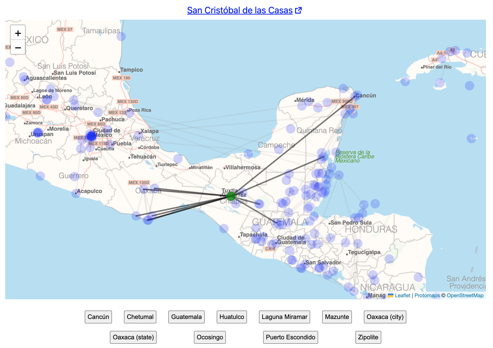

# [Wikivoyage Map](https://wginsberg.github.io/wikivoyage-map)

Wikivoyage Map is a web application that visually maps all the pages of Wikivoyage.org onto an interactive map interface.



## Setup

This project uses node version 14.

Install dependencies:
```
npm install
```

Run the application:
```
npm start
```

This repository contains a copy of all of the data it displays. To update the dataset with the latest pages from Wikivoyage run the following commands (it may take several minutes):
```
npm run fetch-wiki-data
npm run build-data
```
